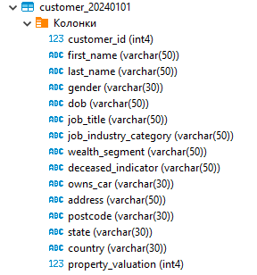
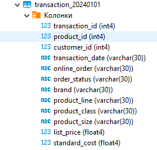

# Группировка данных и оконные функции.

## Обзор
Научиться группировать и агрегировать данные, считать на их основе множество показателей.

## Датасет
Данные лежат в директории **data**. 
- **customer.csv**: Содержит информацию о клиентах.
- **transaction.csv**: Содержит детали транзакций клиентов.

## Этапы выполнения
### 1. Создание таблиц и загрузка данных
Создайте необходимые таблицы в PostgreSQL и загрузите данные из CSV-файлов.

### 2. Выполните следующие запросы
#### Базовые запросы
1. (1 балл) Вывести распределение (количество) клиентов по сферам деятельности, отсортировав результат по убыванию количества.
2. (1 балл) Найти сумму транзакций за каждый месяц по сферам деятельности, отсортировав по месяцам и по сфере деятельности.
3. (1 балл) Вывести количество онлайн-заказов для всех брендов в рамках подтвержденных заказов клиентов из сферы IT.
4. (1 балл) Вывести только самые первые транзакции клиентов. Решить с помощью оконных функций.

#### Продвинутые запросы (2 балла каждый)
1. (2 балла) Найти по всем клиентам сумму всех транзакций (list_price), максимум, минимум и количество транзакций, отсортировав результат по убыванию суммы транзакций и количества транзакций. Выполните двумя способами: используя только group by и используя только оконные функции. Сравните результат.
2. (2 балла) Вывести имена, фамилии и профессии клиентов, между транзакциями которых был максимальный интервал (интервал вычисляется в днях).
3. (2 балла) Найти имена и фамилии клиентов с минимальной/максимальной суммой транзакций за весь период (сумма транзакций не может быть null). Напишите отдельные запросы для минимальной и максимальной суммы.

## Требования
- База данных PostgreSQL
- CSV-файлы: `customer.csv` и `transaction.csv`
- Базовые знания SQL-запросов

## Подготовка к запуску ноутбука
1. Импортируейте данные из папки data в вашу базу(обратите внимание на разделитель - **;**).
2. Установить зависимости из **requirements.txt**
3. Задать пароль для вашей базы данных. В ноутбуке используется dbus для получения пароля из хранилища по ключу **ipynb**, если у вас не установлен dbus или нет хранилища, вставьте пароль в ячейку подключения к базе. 
4. Запустить все ячейки.

## Данные таблиц

### Ожидаемые колонки
 

### Структура таблицы `customer`

| Поле                     | Описание                              |
|--------------------------|---------------------------------------|
| `customer_id`            | ID клиента                           |
| `first_name`             | Имя клиента                          |
| `last_name`              | Фамилия клиента                      |
| `gender`                 | Пол                                  |
| `DOB`                    | Дата рождения                        |
| `job_title`              | Профессия                            |
| `job_industry_category`  | Сфера деятельности                   |
| `wealth_segment`         | Сегмент благосостояния               |
| `deceased_indicator`     | Флаг актуального клиента             |
| `owns_car`               | Флаг наличия автомобиля              |
| `address`                | Адрес проживания                     |
| `postcode`               | Почтовый индекс                      |
| `state`                  | Штат                                 |
| `country`                | Страна проживания                    |
| `property_valuation`     | Оценка имущества                     |

### Структура таблицы `transaction`

| Поле                     | Описание                              |
|--------------------------|---------------------------------------|
| `transaction_id`         | ID транзакции                         |
| `product_id`            | ID продукта                           |
| `customer_id`           | ID клиента                            |
| `transaction_date`      | Дата транзакции                       |
| `online_order`          | Флаг онлайн-заказа                    |
| `order_status`          | Статус транзакции                     |
| `brand`                 | Бренд                                 |
| `product_line`          | Линейка продуктов                     |
| `product_class`         | Класс продукта                        |
| `product_size`          | Размер продукта                       |
| `list_price`            | Цена                                  |
| `standard_cost`         | Стандартная стоимость                 |
